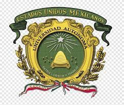
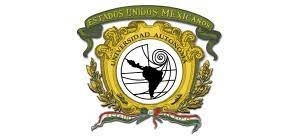

# Taller de Cubo de Datos Universidad Autonoma del Estado de Mexico

     

Taller elaborado para el **Seminario de Innovaciones Geotecnológicas** del programa de posgrado de la **Especialidad en Cartografía Automatizada, Teledetección y SIG** (Promoción 27a), Facultad de Geografía.

