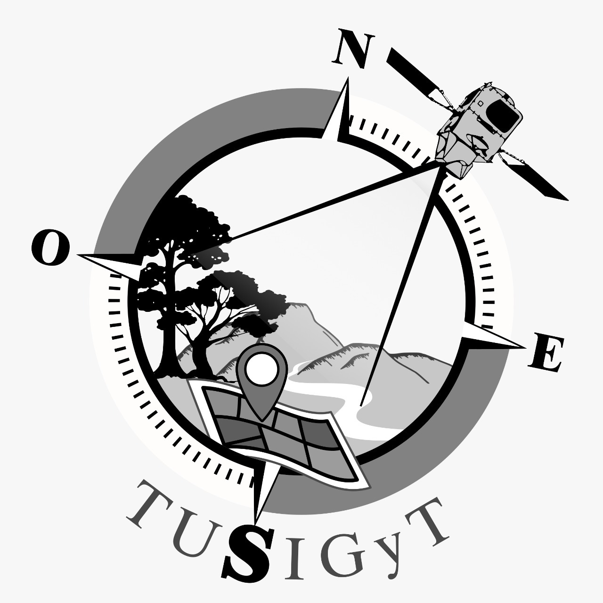
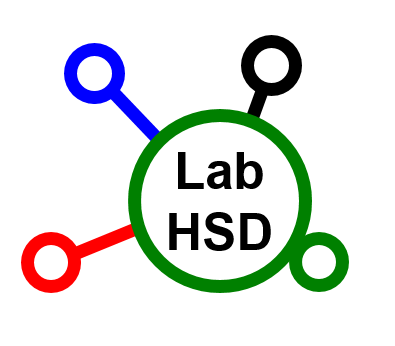
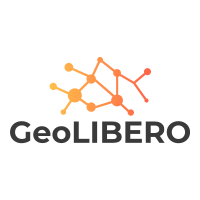

# Taller de Cubo de Datos 

Proyecto producido por [Felipe Sodré Mendes Barros](https://felipesbarros.github.io/) docente de la Facultad de Ciencias Forestales (FCF) de la UNaM (Argentina), en el marco de la red [GEOLibero](https://www.cyted.org/conteudo.php?idnoticia=518&id_rede=110).

## Intituciones

   

## Presentaciones
El presente taller ya fue presentado en:
- 2022: [18as Jornadas gvSIG](http://www.gvsig.com/es/eventos/jornadas-gvsig/18as-jornadas-gvsig)
- 2023/2024: Universidad Autonoma del Estado de Mexico, en el marco del **Seminario de Innovaciones Geotecnológicas** - programa de posgrado **Especialidad en Cartografía Automatizada, Teledetección y SIG**, Facultad de Geografía. 

     

